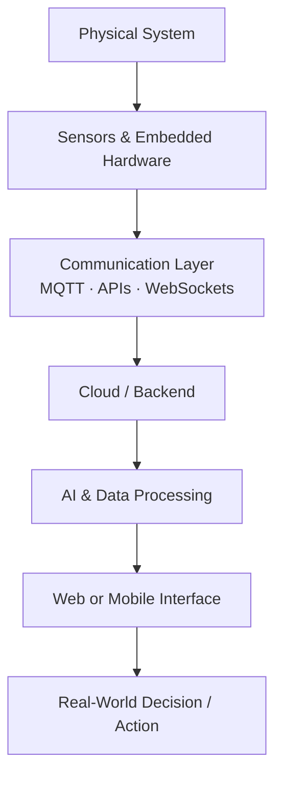

  

  

  
  
  

  <a href="#engineering--technology-stack">Stack</a> •
  <a href="#about-me">About</a> •
  <a href="#current-focus">Focus</a> •
  <a href="#featured-projects">Projects</a> •
  <a href="#system-approach">Approach</a> •
  <a href="#github-activity">Activity</a>

---

## Engineering & Technology Stack

**Engineering & Simulation**

  
  
  
  

**Programming**

  

**Backend & APIs**

  
  
  

**Frontend**

  

**Databases & Cloud**

  

**AI & Machine Learning**

  
  
  

**IoT & Infrastructure**

  
  
  
  
  

---

## About Me

**Collins Powell** — Mechanical Engineer · IoT Builder · AI Explorer, based in Kenya 🇰🇪
Mechanical & Energy Engineering background, working across embedded systems, IoT, and AI to build practical technology for African markets.

---

## Current Focus

- 🚙 Designing and exploring an electric 4×4 powertrain for rough-terrain mobility
- 📡 Building IoT-connected systems using embedded devices, cloud platforms, and real-time communication
- 🧠 Exploring AI applications including deepfake detection and intelligent decision systems
- 🧮 Learning finite element analysis, numerical simulation, and engineering software
- 🌍 Building technology with a focus on practical challenges in Africa and emerging markets

---

## Featured Projects

### 🔐 ProLock
A smart access-control system designed for gyms and small service providers.

**What it explores:**
- PIN-based access control
- Smart locks and embedded hardware
- Cloud-connected membership verification
- Real-time attendance monitoring
- Revenue and facility usage visibility

**Stack:** IoT · Embedded Systems · Cloud · Web Development

---

### 🚙 EV 4×4 Mobility Project
A mechanical and electrical engineering project exploring an electric vehicle designed for rocky and rough terrain.

**Focus areas:**
- Four independent wheel motors
- Electric powertrain architecture
- Wheel and tyre configuration
- Ground clearance
- Approach, departure, and breakover angles
- Vehicle mobility and off-road performance

**Tools & Concepts:** Mechanical Design · EV Systems · FEA · Vehicle Dynamics

---

### 🛡️ Afriguard
An AI-powered deepfake detection concept focused on African faces and WhatsApp accessibility.

**System components:**
- Image deepfake detection
- Voice verification
- Vision Transformer models
- WavLM-based audio analysis
- FastAPI backend
- WhatsApp-first accessibility

**Stack:** Python · FastAPI · PyTorch · Transformers · AI/ML

---

### 🤰 MamaAlert
A maternal health surveillance and early-warning concept designed around low-connectivity environments.

**Focus:**
- Community health worker workflows
- High-risk pregnancy identification
- Early warning systems
- Referral coordination
- Feature phone accessibility
- Offline and low-bandwidth environments

**Stack:** IoT · AI · FastAPI · GIS · Mobile Communication

---

### 💬 HerCycle
A conversational menstrual health platform designed around WhatsApp accessibility.

**Features explored:**
- AI-powered conversations
- WhatsApp integration
- Risk scoring
- Real-time doctor dashboards
- GIS visualization
- WebSocket communication

**Stack:** FastAPI · MongoDB · WebSockets · AI · GIS

---

## System Approach

I am particularly interested in systems where mechanical engineering meets electronics, software, and intelligence.

---

## GitHub Activity

  
  

  

  

### Contribution Activity

  

### Watch My Contributions Move

  

  

---

<i>Engineering systems. Building technology. Solving real problems.</i>

  

